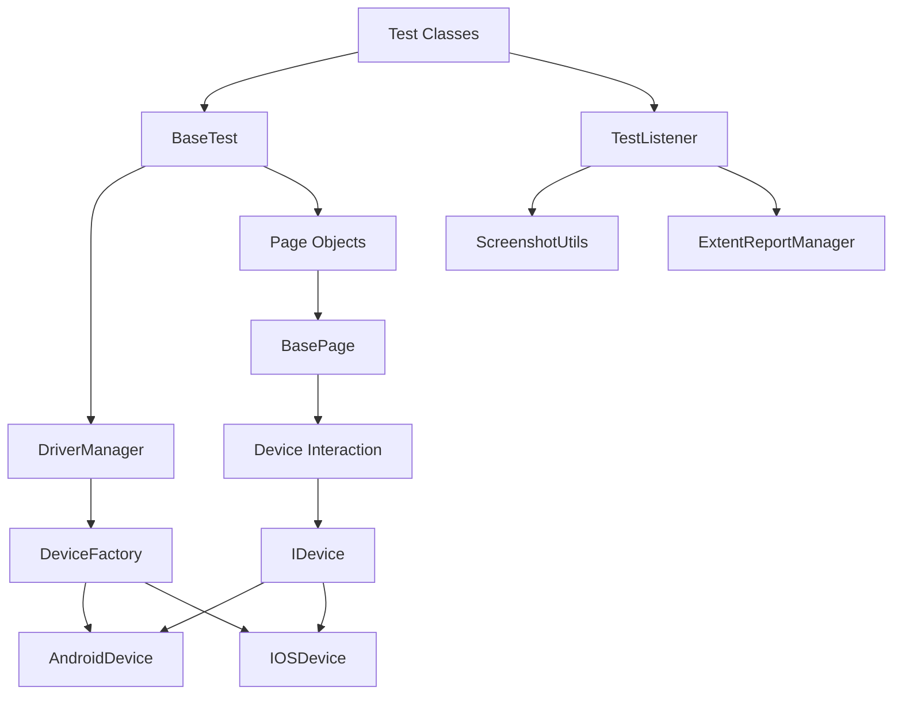

# Architecture Overview

This document provides a detailed overview of the Mobile Test Automation Framework architecture, explaining the key components and how they interact.

## High-Level Architecture

The framework follows a layered architecture that separates concerns and promotes reusability:



## Core Components

### 1. Device Abstraction Layer

The device abstraction layer provides a unified interface for interacting with different mobile platforms:

- **IDevice Interface**: Defines the contract for device interactions
- **BaseDevice**: Abstract class implementing common functionality
- **AndroidDevice**: Android-specific implementation
- **IOSDevice**: iOS-specific implementation
- **DeviceFactory**: Creates the appropriate device instance based on the platform

This layer allows the framework to support multiple platforms while maintaining a consistent API.

### 2. Driver Management

The driver management layer handles the lifecycle of the Appium driver:

- **DriverManager**: Thread-local singleton for driver access
- **Thread Safety**: Each test thread gets its own driver instance
- **Lazy Initialization**: Driver is created only when needed
- **Automatic Cleanup**: Driver is quit when the test is finished

### 3. Page Object Layer

The page object layer encapsulates UI interactions and element locators:

- **BasePage**: Abstract class with common interaction methods
- **Platform-Specific Locators**: Nested classes for Android and iOS locators
- **Fluent API**: Method chaining for readable test code
- **Wait Utilities**: Methods for synchronizing with the UI

### 4. Test Execution Layer

The test execution layer manages the test lifecycle:

- **BaseTest**: Abstract class for common setup and teardown
- **TestNG Integration**: Annotations for test configuration
- **TestListener**: Hooks into the test lifecycle for reporting and error handling

### 5. Reporting Layer

The reporting layer provides detailed test execution reports:

- **ExtentReportManager**: Generates HTML reports
- **ScreenshotUtils**: Captures screenshots on failure
- **Logging**: Comprehensive logging throughout the test lifecycle

## Design Patterns

The framework implements several design patterns to ensure maintainability, scalability, and thread safety:

### 1. Page Object Pattern

The Page Object Pattern separates UI interaction logic from test logic:

```java
public class LoginPage extends BasePage {
    // Locators
    private static class Locators {
        private static class Android {
            static final By USERNAME_FIELD = By.id("android:id/username");
        }
        
        private static class IOS {
            static final By USERNAME_FIELD = By.xpath("//XCUIElementTypeTextField[@name='username']");
        }
    }
    
    // Methods
    public LoginPage enterUsername(String username) {
        type(getLocator(Locators.Android.USERNAME_FIELD, Locators.IOS.USERNAME_FIELD), username);
        return this;
    }
    
    // More methods...
}
```

Benefits:
- Encapsulates UI interactions
- Separates platform-specific locators
- Provides a clean API for tests

### 2. Factory Pattern

The Factory Pattern is used to create platform-specific device instances:

```java
public class DeviceFactory {
    public static IDevice createDevice(String platform, Map<String, Object> capabilities) {
        switch (platform.toLowerCase()) {
            case "android":
                return new AndroidDevice(capabilities);
            case "ios":
                return new IOSDevice(capabilities);
            default:
                throw new IllegalArgumentException("Unsupported platform: " + platform);
        }
    }
}
```

Benefits:
- Encapsulates object creation logic
- Allows for platform-specific implementations
- Makes it easy to add support for new platforms

### 3. Singleton Pattern (Thread-Safe)

The Singleton Pattern is used for the DriverManager to ensure a single point of access to driver instances:

```java
public class DriverManager {
    private static final ThreadLocal<IDevice> deviceThreadLocal = new ThreadLocal<>();
    
    public static IDevice getDriver() {
        return deviceThreadLocal.get();
    }
    
    public static void setDriver(IDevice device) {
        deviceThreadLocal.set(device);
    }
    
    public static void quitDriver() {
        IDevice device = deviceThreadLocal.get();
        if (device != null) {
            device.quit();
            deviceThreadLocal.remove();
        }
    }
}
```

Benefits:
- Thread safety for parallel execution
- Centralized driver management
- Automatic cleanup of resources

### 4. Builder Pattern

The Builder Pattern is used for constructing complex objects:

```java
public class CapabilitiesBuilder {
    private final Map<String, Object> capabilities = new HashMap<>();
    
    public CapabilitiesBuilder withPlatformName(String platformName) {
        capabilities.put("platformName", platformName);
        return this;
    }
    
    public CapabilitiesBuilder withDeviceName(String deviceName) {
        capabilities.put("deviceName", deviceName);
        return this;
    }
    
    // More builder methods...
    
    public Map<String, Object> build() {
        return capabilities;
    }
}
```

Benefits:
- Readable object construction
- Optional parameters
- Method chaining

## Data Flow

The data flow through the framework follows these steps:

1. **Test Initialization**:
   - BaseTest creates test configuration
   - DeviceFactory creates the appropriate device
   - DriverManager stores the device instance

2. **Test Execution**:
   - Test class creates page objects
   - Page objects interact with the device
   - Assertions verify the expected behavior

3. **Test Completion**:
   - TestListener captures the test result
   - Screenshots are taken on failure
   - Reports are generated
   - Driver is quit and resources are cleaned up

## Thread Safety

The framework is designed to be thread-safe for parallel test execution:

- **ThreadLocal Storage**: Each thread has its own driver instance
- **Stateless Page Objects**: Page objects don't store state between method calls
- **Thread-Safe Reporting**: ExtentReports is configured for concurrent access
- **Isolated Test Data**: Each test has its own data

## Extensibility

The framework is designed to be extensible:

- **Abstract Base Classes**: Can be extended for custom functionality
- **Interface-Based Design**: Allows for alternative implementations
- **Hooks**: BaseTest and TestListener provide hooks for customization
- **Configuration**: External configuration for environment-specific settings

## Conclusion

The Mobile Test Automation Framework provides a robust, scalable, and maintainable architecture for mobile application testing. By implementing design patterns like Page Object, Factory, and Singleton, it ensures clean separation of concerns and thread safety for parallel execution.
