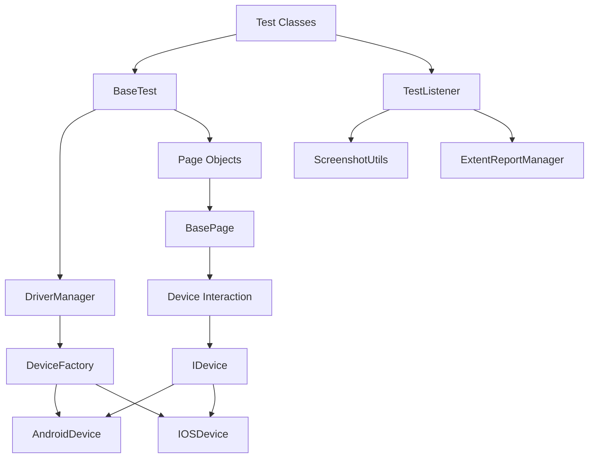

# Mobile Test Automation Framework - System Patterns

## System Architecture

The Mobile Test Automation Framework is built with a layered architecture that separates concerns and promotes reusability:



### Layer 1: Test Execution
- **TestNG**: Provides the test execution engine
- **BaseTest**: Abstract class that all test classes extend
- **TestListener**: Handles test lifecycle events for reporting and error handling

### Layer 2: Page Objects
- **BasePage**: Abstract class that all page objects extend
- **Page Classes**: Encapsulate UI interactions and element locators
- **Fluent API**: Method chaining for readable test code

### Layer 3: Device Abstraction
- **IDevice**: Interface defining device interaction contract
- **BaseDevice**: Common implementation for both platforms
- **Platform-specific Implementations**: AndroidDevice and IOSDevice
- **Mobile Gestures**: Advanced gesture handling for complex interactions
- **Device Capabilities**: Platform-specific capability management

### Layer 4: Driver Management
- **DriverManager**: Thread-local singleton for driver access
- **DeviceFactory**: Creates appropriate device instances
- **Configuration Management**: Handles environment-specific settings

### Layer 5: Utilities
- **ScreenshotUtils**: Captures and manages screenshots
- **ExtentReportManager**: Generates HTML reports
- **MobileInteractionUtils**: Common mobile-specific interactions
- **Error Handling**: Enhanced error reporting with context
- **Documentation**: Wiki-style documentation and examples

## Key Technical Decisions

### 1. Thread-Local Storage for Driver Instances

```java
public class DriverManager {
    private static final ThreadLocal<IDevice> deviceThreadLocal = new ThreadLocal<>();
    
    // Methods to get, set, and quit the device instance
}
```

**Rationale**: This pattern ensures thread safety for parallel test execution by giving each thread its own device instance.

### 2. Factory Pattern for Device Creation

```java
public class DeviceFactory {
    public static IDevice createDevice(String platform, Map<String, Object> capabilities) {
        switch (platform.toLowerCase()) {
            case "android":
                return new AndroidDevice(capabilities);
            case "ios":
                return new IOSDevice(capabilities);
            default:
                throw new IllegalArgumentException("Unsupported platform: " + platform);
        }
    }
}
```

**Rationale**: This pattern encapsulates the logic for creating platform-specific device instances, making it easy to add support for new platforms.

### 3. Page Object Model with Platform-Specific Locators

```java
public class LoginPage extends BasePage {
    private static class Locators {
        private static class Android {
            static final By USERNAME_FIELD = By.id("android:id/username");
        }
        
        private static class IOS {
            static final By USERNAME_FIELD = By.xpath("//XCUIElementTypeTextField[@name='username']");
        }
    }
    
    private By getUsernameField() {
        return getLocator(Locators.Android.USERNAME_FIELD, Locators.IOS.USERNAME_FIELD);
    }
    
    // Enhanced method with fluent API
    public LoginPage enterUsername(String username) {
        type(getUsernameField(), username);
        return this;
    }
}
```

**Rationale**: This approach keeps platform-specific locators organized and encapsulated within the page object, making it easy to maintain and update. The fluent API pattern allows for method chaining, resulting in more readable test code.

### 4. Abstract Base Classes for Common Functionality

```java
public abstract class BasePage {
    // Common methods for all page objects
    
    protected abstract boolean isPageLoaded();
    
    public <T extends BasePage> T waitForPageToLoad() {
        // Wait for the page to load
        return (T) this;
    }
}
```

**Rationale**: Abstract base classes provide common functionality while allowing for specialization in subclasses, reducing code duplication.

### 5. TestNG Listeners for Reporting and Error Handling

```java
public class TestListener implements ITestListener {
    @Override
    public void onTestFailure(ITestResult result) {
        // Get device information
        Map<String, Object> deviceInfo = getDeviceInfo();
        
        // Log failure details with enhanced context
        Throwable throwable = result.getThrowable();
        if (throwable != null) {
            ExtentReportManager.log(Status.FAIL, "Test failed: " + throwable.getMessage());
            
            // Add stack trace
            StringWriter sw = new StringWriter();
            PrintWriter pw = new PrintWriter(sw);
            throwable.printStackTrace(pw);
            ExtentReportManager.log(Status.INFO, "Stack trace:\n" + sw.toString());
        }
        
        // Capture screenshot
        String screenshotPath = ScreenshotUtils.captureScreenshot(testName);
        ExtentReportManager.log(Status.FAIL, "Failure screenshot", screenshotPath);
        
        // Capture page source
        String pageSource = driver.getPageSource();
        ExtentReportManager.log(Status.INFO, "Page source available but not displayed in report");
    }
    
    // Other listener methods
}
```

**Rationale**: Enhanced TestNG listeners provide detailed context for test failures, making debugging easier. By capturing device information, screenshots, and page source, the framework provides comprehensive information about the test environment at the time of failure.

## Design Patterns in Use

### 1. Singleton Pattern (Thread-Safe)
Used for the DriverManager to ensure a single point of access to driver instances while maintaining thread safety.

### 2. Factory Pattern
Used for the DeviceFactory to create platform-specific device instances based on runtime parameters.

### 3. Page Object Pattern
Used to encapsulate UI interactions and element locators, providing a clean separation between test logic and UI details.

### 4. Decorator Pattern
Used for adding functionality like logging to page objects without modifying their core behavior.

### 5. Builder Pattern
Used in fluent APIs for constructing complex objects or configurations with a readable syntax.

### 6. Strategy Pattern
Used for implementing different strategies for element location and interaction based on the platform.

### 7. Command Pattern
Used for encapsulating mobile gestures and interactions as commands, allowing for better abstraction and reuse.

### 8. Observer Pattern
Used in the reporting system to notify listeners of test events and update reports accordingly.

## Component Relationships

### Test Classes and BaseTest
- Test classes extend BaseTest to inherit common setup and teardown functionality
- BaseTest manages the test lifecycle and provides access to page objects
- BaseTest provides hooks for platform-specific capability configuration

### BaseTest and DriverManager
- BaseTest initializes the driver through DriverManager
- DriverManager provides thread-safe access to the driver instance

### Page Objects and BasePage
- Page objects extend BasePage to inherit common interaction methods
- BasePage provides platform-agnostic methods for element interaction
- BasePage includes enhanced utility methods for common mobile interactions:
  - Scrolling to elements
  - Long press gestures
  - Alert handling
  - Attribute retrieval
  - Presence and visibility checks

### DriverManager and DeviceFactory
- DriverManager uses DeviceFactory to create the appropriate device instance
- DeviceFactory encapsulates the logic for creating platform-specific device instances

### TestListener and Reporting
- TestListener hooks into the test lifecycle to capture events
- TestListener uses ScreenshotUtils and ExtentReportManager to generate reports
- Enhanced error reporting captures device information, stack traces, and page source
- Detailed test execution logs provide context for debugging

### Documentation and Code
- Wiki-style documentation in docs/ directory provides comprehensive guides
- Architecture documentation explains component relationships and design decisions
- Troubleshooting guide helps resolve common issues
- Code examples demonstrate best practices for framework usage
